# ICS-IDS dataset study: comparison and merge recommendation

Generated by `dataset_study/report.py` from the saved run results. Reproduce with `python dataset_study/run_all.py`.

## Summary

- **Merge Edge-IIoTset + TON_IoT-Network, and add X-IIoTID for attack coverage.** These are the only datasets with a learnable signal after de-duplication. Edge-IIoTset and TON_IoT-Network transfer to each other and lose nothing when merged. X-IIoTID is learnable on its own but does not transfer, and merging lowers its own F1.
- **Exclude BATADAL and TON_IoT-Modbus from the merge.** After de-duplication, every supervised model scores at chance on them (test ROC-AUC 0.09–0.54).
- **Use LightGBM as the final model.** It has the best or tied-best attack F1 on every learnable dataset.
- **The project's zero-shot similarity method does not detect attacks in any of the five datasets.** Its ROC-AUC is 0.43–0.51 on four datasets and 0.74 on TON_IoT-Network. At the deployed threshold (0.416) it flags either 0% of rows or 83–100% of them.
- **Most published-style near-100% scores in these datasets come from duplicated rows.** TON_IoT-Modbus drops from 0.97 to 0.54 accuracy when duplicates are removed. The three network datasets stay above 99% after de-duplication, with no single-feature leak. But their patterns transfer poorly to other datasets, so those scores mostly reflect each testbed, not general attack detection.

All numbers below come from the runs in this study (seed 42). The judgement calls are mine and are marked as recommendations.

## 1. Dataset summary

Sampling policy (same for every dataset): after removing duplicates, each dataset is capped at 250,000 rows, stratified by its finest attack-type label, keeping at least 1,000 rows per class (or all rows if fewer). Sub-sampled after de-duplication: **X-IIoTID**; all other main datasets are used in full. Splits: 70/15/15 stratified unless noted. Classes with fewer than 10 unique rows after de-duplication go to the training split only.

| Dataset | Type | Raw rows | Unique rows | Duplicates removed | Rows with conflicting labels | Train / val / test | Attack % (tr/va/te) | Features (num + cat) | Cols dropped | Split |
|---|---|---|---|---|---|---|---|---|---|---|
| BATADAL | process/sensor telemetry (water distribution SCADA, hourly) | 12,938 | 12,938 | 0 (0.0%) | 0 | 11,353 / 624 / 961 | 0.9 / 5.9 / 8.3 | 36 + 0 | 8 | chronological |
| Edge-IIoTset | network traffic (packet-level, incl. Modbus/MQTT/HTTP/DNS fields) | 2,219,201 | 6,513 | 2,212,688 (99.7%) | 61 | 4,561 / 976 / 976 | 58.7 / 58.6 / 58.6 | 36 + 6 | 28 | stratified |
| X-IIoTID | network flow + host telemetry (+ OSSEC/host alerts) | 820,834 | 734,479 | 86,355 (10.5%) | 6 | 174,995 / 37,499 / 37,499 | 46.9 / 46.9 / 46.9 | 56 + 2 | 8 | stratified |
| TON_IoT-Network | network traffic (Zeek flows) | 211,043 | 104,722 | 106,321 (50.4%) | 19 | 73,305 / 15,708 / 15,709 | 77.0 / 77.0 / 77.0 | 22 + 18 | 9 | stratified |
| TON_IoT-Modbus | IoT/IIoT device telemetry (Modbus function-code register values) | 31,106 | 8,868 | 22,238 (71.5%) | 0 | 6,207 / 1,330 / 1,331 | 57.7 / 57.7 / 57.7 | 4 + 0 | 2 | stratified |

**Duplicates are counted after identifier columns are removed** (a row that differs only by timestamp/IP/port/sequence number is a duplicate). 'Conflicting labels' = rows whose feature vector also occurs with the other label (irreducible error).

### Fields kept per dataset

Same policy for every network dataset: identifiers (IPs, timestamps), per-packet counters and checksums are dropped; the two raw port numbers become one `service_port` (lower, server-side port); raw strings (payloads, URIs, queries, DNS names, certificates, user agents) become length and injection-character-count summaries. HTTP method + URI (first 80 chars) is kept only for the text descriptions used by the embedding/zero-shot methods, never as a tabular feature.

**BATADAL** (36 features)

- Original fields kept: `L_T1`, `L_T2`, `L_T3`, `L_T4`, `L_T5`, `L_T6`, `L_T7`, `F_PU1`, `F_PU2`, `S_PU2`, `F_PU4`, `S_PU4`, `F_PU6`, `S_PU6`, `F_PU7`, `S_PU7`, `F_PU8`, `S_PU8`, `F_PU10`, `S_PU10`, `F_PU11`, `S_PU11`, `F_V2`, `S_V2`, `P_J280`, `P_J269`, `P_J300`, `P_J256`, `P_J289`, `P_J415`, `P_J302`, `P_J306`, `P_J307`, `P_J317`, `P_J14`, `P_J422`

**Edge-IIoTset** (42 features)

- Original fields kept: `arp.opcode`, `arp.hw.size`, `http.content_length`, `http.response`, `tcp.connection.fin`, `tcp.connection.rst`, `tcp.connection.syn`, `tcp.connection.synack`, `tcp.flags`, `tcp.flags.ack`, `tcp.len`, `udp.port`, `udp.time_delta`, `dns.qry.qu`, `dns.retransmission`, `dns.retransmit_request`, `dns.retransmit_request_in`, `mqtt.conflag.cleansess`, `mqtt.conflags`, `mqtt.hdrflags`, `mqtt.len`, `mqtt.msgtype`, `mqtt.proto_len`, `mqtt.topic_len`, `mqtt.ver`, `mbtcp.len`, `mbtcp.unit_id`, `http.request.method`, `http.referer`, `http.request.version`, `mqtt.protoname`, `mqtt.topic`, `mqtt.conack.flags`
- Derived fields: `service_port`, `len_tcp_payload`, `len_http_file_data`, `len_http_uri`, `len_http_query`, `inj_http_uri`, `inj_http_query`, `len_mqtt_msg`, `len_dns_name`
- Text-only (descriptions, not tabular): `__txt_http`

**X-IIoTID** (58 features)

- Original fields kept: `Duration`, `Scr_bytes`, `Des_bytes`, `Conn_state`, `missed_bytes`, `is_syn_only`, `Is_SYN_ACK`, `is_pure_ack`, `is_with_payload`, `FIN or RST`, `Scr_pkts`, `Scr_ip_bytes`, `Des_pkts`, `Des_ip_bytes`, `anomaly_alert`, `total_bytes`, `total_packet`, `paket_rate`, `byte_rate`, `Scr_packts_ratio`, `Des_pkts_ratio`, `Scr_bytes_ratio`, `Des_bytes_ratio`, `Avg_user_time`, `Std_user_time`, `Avg_nice_time`, `Std_nice_time`, `Avg_system_time`, `Std_system_time`, `Avg_iowait_time`, `Std_iowait_time`, `Avg_ideal_time`, `Std_ideal_time`, `Avg_tps`, `Std_tps`, `Avg_rtps`, `Std_rtps`, `Avg_wtps`, `Std_wtps`, `Avg_ldavg_1`, `Std_ldavg_1`, `Avg_kbmemused`, `Std_kbmemused`, `Avg_num_Proc/s`, `Std_num_proc/s`, `Avg_num_cswch/s`, `std_num_cswch/s`, `OSSEC_alert`, `OSSEC_alert_level`, `Login_attempt`, `Succesful_login`, `File_activity`, `Process_activity`, `read_write_physical.process`, `is_privileged`, `Protocol`, `Service`
- Derived fields: `service_port`

**TON_IoT-Network** (40 features)

- Original fields kept: `duration`, `src_bytes`, `dst_bytes`, `missed_bytes`, `src_pkts`, `src_ip_bytes`, `dst_pkts`, `dst_ip_bytes`, `dns_qclass`, `dns_qtype`, `dns_rcode`, `http_trans_depth`, `http_request_body_len`, `http_response_body_len`, `http_status_code`, `proto`, `service`, `conn_state`, `dns_AA`, `dns_RD`, `dns_RA`, `dns_rejected`, `ssl_version`, `ssl_cipher`, `ssl_resumed`, `ssl_established`, `http_method`, `http_version`, `http_orig_mime_types`, `http_resp_mime_types`, `weird_name`, `weird_addl`, `weird_notice`
- Derived fields: `service_port`, `len_dns_query`, `len_http_uri`, `inj_http_uri`, `len_http_user_agent`, `len_ssl_subject`, `len_ssl_issuer`
- Text-only (descriptions, not tabular): `__txt_http`

**TON_IoT-Modbus** (4 features)

- Original fields kept: `FC1_Read_Input_Register`, `FC2_Read_Discrete_Value`, `FC3_Read_Holding_Register`, `FC4_Read_Coil`

| Derived field | Definition |
|---|---|
| `service_port` | lower non-zero of the two port numbers (server/service side); client ephemeral port discarded |
| `len_*` | character length of the raw string (bytes for hex payloads); 0 when absent |
| `inj_*` | count of injection-typical characters ' " < > % ; and '..' in the URI/query |
| `__txt_http` | HTTP method + first 80 chars of URI: used ONLY in the text descriptions, never as a tabular feature |

### Columns dropped and why

**BATADAL**

- `DATETIME`: timestamp/date: identifies capture session, not behaviour (used only to order rows for the chronological split)
- `S_PU1`, `F_PU3`, `S_PU3`, `F_PU5`, `S_PU5`, `F_PU9`, `S_PU9`: constant in training split

**Edge-IIoTset**

- `frame.time`: timestamp/date: identifies capture session, not behaviour; also column-misaligned for all DDoS_UDP/MITM rows
- `ip.src_host`, `ip.dst_host`, `arp.src.proto_ipv4`, `arp.dst.proto_ipv4`: IP address: host identifier, lets the model memorise testbed hosts
- `tcp.srcport`, `tcp.dstport`: raw client/server port: replaced by derived service_port (the lower, server-side port)
- `tcp.ack`, `tcp.ack_raw`, `tcp.seq`, `tcp.checksum`, `icmp.checksum`, `icmp.seq_le`, `icmp.transmit_timestamp`, `udp.stream`, `mbtcp.trans_id`: per-packet sequence/ack/checksum/stream counter: identifier, not behaviour
- `tcp.options`: raw TCP options bytes: embed per-packet TCP timestamp values (counter)
- `tcp.payload`, `http.file_data`, `http.request.full_uri`, `http.request.uri.query`, `mqtt.msg`, `dns.qry.name`: raw string: replaced by length (+ injection-character count for URIs/queries) summaries
- `dns.qry.name.len`: header-misaligned in source (holds hostnames); its length is kept as len_dns_name
- `icmp.unused`, `http.tls_port`, `dns.qry.type`, `mqtt.msg_decoded_as`: constant in training split

**X-IIoTID**

- `Date`, `Timestamp`: timestamp/date: identifies capture session, not behaviour
- `Scr_IP`, `Des_IP`: IP address: host identifier, lets the model memorise testbed hosts
- `Scr_port`, `Des_port`: raw client/server port: replaced by derived service_port (the lower, server-side port)
- `Bad_checksum`, `is_SYN_with_RST`: constant in training split

**TON_IoT-Network**

- `src_ip`, `dst_ip`: IP address: host identifier, lets the model memorise testbed hosts
- `src_port`, `dst_port`: raw client/server port: replaced by derived service_port (the lower, server-side port)
- `dns_query`, `ssl_subject`, `ssl_issuer`, `http_uri`, `http_user_agent`: raw string: replaced by length (+ injection-character count for URIs/queries) summaries

**TON_IoT-Modbus**

- `date`: timestamp/date: identifies capture session, not behaviour
- `time`: timestamp/date: identifies capture session, not behaviour; leading-space format differs by label (leak)

### Per-class counts before and after de-duplication

Edge-IIoTset

| Type | Before | After |
|---|---|---|
| Normal | 1,615,643 | 2,693 |
| DDoS_UDP | 121,568 | 1 |
| DDoS_ICMP | 116,436 | 3 |
| SQL_injection | 51,203 | 256 |
| Password | 50,153 | 17 |
| Vulnerability_scanner | 50,110 | 2,610 |
| DDoS_TCP | 50,062 | 54 |
| DDoS_HTTP | 49,911 | 227 |
| Uploading | 37,634 | 36 |
| Backdoor | 24,862 | 138 |
| Port_Scanning | 22,564 | 5 |
| XSS | 15,915 | 51 |
| Ransomware | 10,925 | 32 |
| MITM | 1,214 | 117 |
| Fingerprinting | 1,001 | 273 |

Train-only (fewer than 10 unique rows): {'Port_Scanning': 5, 'DDoS_ICMP': 3, 'DDoS_UDP': 1}

X-IIoTID

| Type | Before | After |
|---|---|---|
| Normal | 421,417 | 406,197 |
| RDOS | 141,261 | 77,134 |
| Scanning_vulnerability | 52,852 | 52,710 |
| Generic_scanning | 50,277 | 50,178 |
| BruteForce | 47,241 | 46,990 |
| MQTT_cloud_broker_subscription | 23,524 | 20,806 |
| Discovering_resources | 23,148 | 22,753 |
| Exfiltration | 22,134 | 22,133 |
| insider_malcious | 17,447 | 14,736 |
| Modbus_register_reading | 5,953 | 5,953 |
| False_data_injection | 5,094 | 5,073 |
| C&C | 2,863 | 2,849 |
| Dictionary | 2,572 | 2,093 |
| TCP Relay | 2,119 | 2,116 |
| fuzzing | 1,313 | 1,145 |
| Reverse_shell | 1,016 | 1,015 |
| crypto-ransomware | 458 | 458 |
| MitM | 117 | 112 |
| Fake_notification | 28 | 28 |

TON_IoT-Network

| Type | Before | After |
|---|---|---|
| normal | 50,000 | 24,114 |
| backdoor | 20,000 | 2,423 |
| ddos | 20,000 | 12,532 |
| dos | 20,000 | 14,473 |
| injection | 20,000 | 19,850 |
| password | 20,000 | 15,353 |
| scanning | 20,000 | 5,744 |
| ransomware | 20,000 | 454 |
| xss | 20,000 | 8,740 |
| mitm | 1,043 | 1,039 |

TON_IoT-Modbus

| Type | Before | After |
|---|---|---|
| normal | 15,000 | 3,752 |
| injection | 5,000 | 1,323 |
| backdoor | 5,000 | 1,544 |
| password | 5,000 | 1,712 |
| xss | 577 | 245 |
| scanning | 529 | 292 |

## 2. Per-dataset metrics (held-out test set)

Models: Logistic Regression (baseline), Random Forest, LightGBM, MLP (PyTorch). Class weights 'balanced'; no oversampling. Light hyperparameter search scored on the validation split (attack F1 for binary, macro-F1 for multiclass); multiclass reuses the binary-selected configuration. Decision threshold 0.5. Seed 42 throughout. Inference time includes preprocessing.

### BATADAL

Split: chronological: train < 2016-10-20 (dataset03 + dataset04 windows 1-2), val < 2016-11-15 (window 3), test after (windows 4-5). Test rows: 961 (8.3% attack).

| Model | Acc | Prec | Recall | F1 (attack) | Macro-F1 | ROC-AUC | PR-AUC | FPR | FNR | Train s | Infer ms/1k rows |
|---|---|---|---|---|---|---|---|---|---|---|---|
| LogReg | 0.828 | 0.011 | 0.013 | 0.012 | 0.459 | 0.095 | 0.045 | 0.098 | 0.988 | 0.1 | 2.20 |
| RandomForest | 0.915 | 0.000 | 0.000 | 0.000 | 0.478 | 0.513 | 0.086 | 0.002 | 1.000 | 0.5 | 27.47 |
| LightGBM | 0.915 | 0.000 | 0.000 | 0.000 | 0.478 | 0.508 | 0.090 | 0.002 | 1.000 | 0.1 | 3.03 |
| MLP | 0.742 | 0.038 | 0.087 | 0.053 | 0.452 | 0.167 | 0.049 | 0.199 | 0.912 | 1.4 | 2.71 |

Project zero-shot method (web app model `all-MiniLM-L6-v2`, 97 technique texts), on a stratified test sample of 961 rows (80 attack); ROC/PR-AUC use the raw max-similarity score. Inference time includes embedding on CPU.

| Model | Acc | Prec | Recall | F1 (attack) | Macro-F1 | ROC-AUC | PR-AUC | FPR | FNR | Train s | Infer ms/1k rows |
|---|---|---|---|---|---|---|---|---|---|---|---|
| Zero-shot, deployed threshold (0.416) | 0.917 | 0.000 | 0.000 | 0.000 | 0.478 | 0.477 | 0.076 | 0.000 | 1.000 | none | 25486 |
| Zero-shot, threshold tuned on train sample (0.143) | 0.084 | 0.083 | 1.000 | 0.154 | 0.078 | 0.477 | 0.076 | 0.999 | 0.000 | none | 25486 |

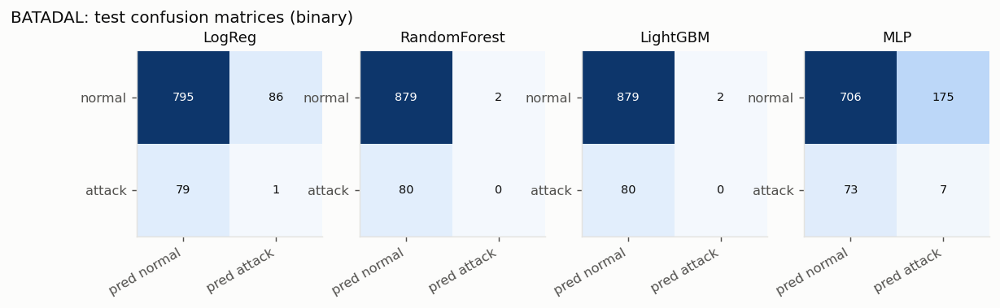

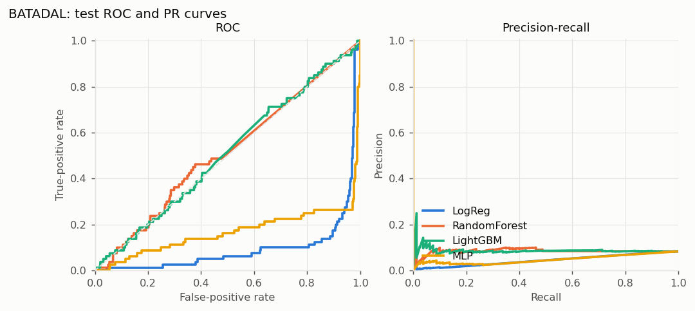

#### BATADAL leave-one-attack-window-out (LOWO)

dataset04 is cut at the midpoints between its 5 labelled attack windows; each fold tests on one segment and trains on dataset03 + the other segments (so training data may come *after* the test period). Hyperparameters fixed to the main-split selection. Caveat: `-999` rows are treated as normal, but some may be unlabelled attacks.

| Model | Window 1 F1 / AUC | Window 2 F1 / AUC | Window 3 F1 / AUC | Window 4 F1 / AUC | Window 5 F1 / AUC | Mean F1 ± sd | Mean AUC ± sd |
|---|---|---|---|---|---|---|---|
| LogReg | 0.02 / 0.24 | 0.43 / 0.80 | 0.46 / 0.92 | 0.03 / 0.49 | 0.05 / 0.09 | 0.199 ± 0.203 | 0.507 ± 0.317 |
| RandomForest | 0.00 / 0.66 | 0.00 / 0.92 | 0.10 / 0.95 | 0.00 / 0.89 | 0.00 / 0.53 | 0.021 ± 0.041 | 0.789 ± 0.166 |
| LightGBM | 0.00 / 0.47 | 0.31 / 0.88 | 0.26 / 0.92 | 0.08 / 0.82 | 0.00 / 0.47 | 0.131 ± 0.131 | 0.712 ± 0.200 |
| MLP | 0.02 / 0.26 | 0.17 / 0.65 | 0.20 / 0.72 | 0.03 / 0.54 | 0.02 / 0.11 | 0.087 ± 0.078 | 0.457 ± 0.235 |

### Edge-IIoTset

Split: stratified random 70/15/15 by finest attack type (no usable time order). Test rows: 976 (58.6% attack).

| Model | Acc | Prec | Recall | F1 (attack) | Macro-F1 | ROC-AUC | PR-AUC | FPR | FNR | Train s | Infer ms/1k rows |
|---|---|---|---|---|---|---|---|---|---|---|---|
| LogReg | 0.964 | 0.989 | 0.949 | 0.969 | 0.963 | 0.995 | 0.997 | 0.015 | 0.051 | 0.0 | 6.58 |
| RandomForest | 0.992 | 0.993 | 0.993 | 0.993 | 0.992 | 0.997 | 0.997 | 0.010 | 0.007 | 0.6 | 44.71 |
| LightGBM | 0.994 | 0.996 | 0.993 | 0.995 | 0.994 | 1.000 | 1.000 | 0.005 | 0.007 | 0.6 | 9.38 |
| MLP | 0.968 | 0.991 | 0.955 | 0.972 | 0.968 | 0.996 | 0.994 | 0.012 | 0.045 | 3.0 | 9.47 |

Project zero-shot method (web app model `all-MiniLM-L6-v2`, 97 technique texts), on a stratified test sample of 976 rows (572 attack); ROC/PR-AUC use the raw max-similarity score. Inference time includes embedding on CPU.

| Model | Acc | Prec | Recall | F1 (attack) | Macro-F1 | ROC-AUC | PR-AUC | FPR | FNR | Train s | Infer ms/1k rows |
|---|---|---|---|---|---|---|---|---|---|---|---|
| Zero-shot, deployed threshold (0.416) | 0.504 | 0.554 | 0.788 | 0.651 | 0.398 | 0.434 | 0.597 | 0.899 | 0.212 | none | 9170 |
| Zero-shot, threshold tuned on train sample (0.338) | 0.597 | 0.594 | 0.988 | 0.742 | 0.413 | 0.434 | 0.597 | 0.955 | 0.012 | none | 9170 |

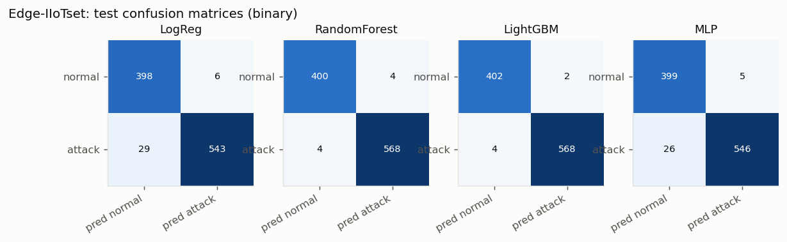

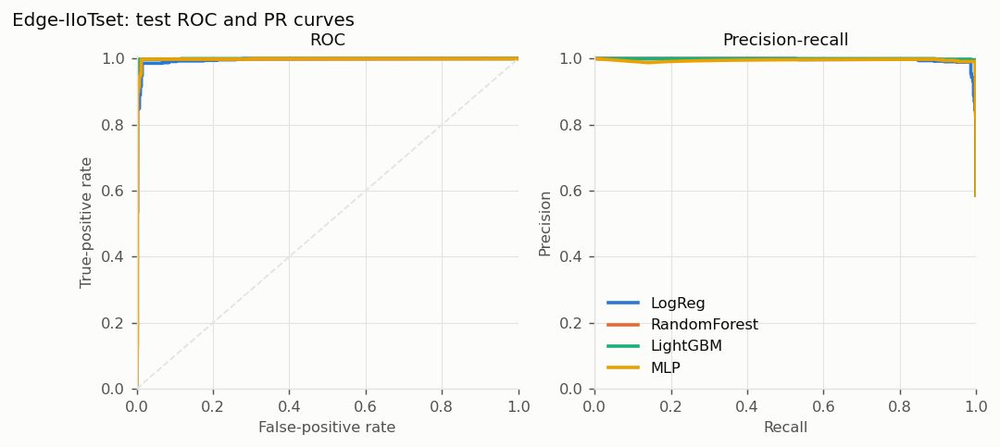

#### Edge-IIoTset: multiclass

| Model | Acc | Macro-F1 | Weighted-F1 | ROC-AUC (OvR macro) |
|---|---|---|---|---|
| LogReg | 0.930 | 0.551 | 0.945 | n/a |
| RandomForest | 0.955 | 0.533 | 0.960 | n/a |
| LightGBM | 0.962 | 0.599 | 0.968 | n/a |
| MLP | 0.666 | 0.401 | 0.738 | n/a |

Per-class results, best model by macro-F1 (LightGBM):

| Class | Precision | Recall | F1 | Test support |
|---|---|---|---|---|
| Backdoor | 0.750 | 0.714 | 0.732 | 21 |
| DDoS_HTTP | 0.912 | 0.912 | 0.912 | 34 |
| DDoS_ICMP | 0.000 | 0.000 | 0.000 | 0 |
| DDoS_TCP | 1.000 | 1.000 | 1.000 | 8 |
| DDoS_UDP | 0.000 | 0.000 | 0.000 | 0 |
| Fingerprinting | 1.000 | 0.976 | 0.988 | 41 |
| MITM | 1.000 | 1.000 | 1.000 | 17 |
| Normal | 0.998 | 0.995 | 0.996 | 404 |
| Password | 0.000 | 0.000 | 0.000 | 2 |
| Port_Scanning | 0.000 | 0.000 | 0.000 | 0 |
| Ransomware | 0.000 | 0.000 | 0.000 | 5 |
| SQL_injection | 0.972 | 0.897 | 0.933 | 39 |
| Uploading | 0.500 | 0.167 | 0.250 | 6 |
| Vulnerability_scanner | 0.997 | 0.982 | 0.990 | 392 |
| XSS | 0.500 | 0.714 | 0.588 | 7 |

### X-IIoTID

Split: stratified random 70/15/15 by finest attack type (no usable time order). Test rows: 37,499 (46.9% attack).

| Model | Acc | Prec | Recall | F1 (attack) | Macro-F1 | ROC-AUC | PR-AUC | FPR | FNR | Train s | Infer ms/1k rows |
|---|---|---|---|---|---|---|---|---|---|---|---|
| LogReg | 0.972 | 0.984 | 0.955 | 0.969 | 0.972 | 0.992 | 0.990 | 0.014 | 0.045 | 28.1 | 3.11 |
| RandomForest | 0.994 | 0.998 | 0.990 | 0.994 | 0.994 | 1.000 | 1.000 | 0.002 | 0.010 | 23.4 | 8.45 |
| LightGBM | 0.996 | 0.997 | 0.994 | 0.996 | 0.996 | 1.000 | 1.000 | 0.002 | 0.006 | 6.9 | 8.71 |
| MLP | 0.986 | 0.991 | 0.979 | 0.985 | 0.986 | 0.999 | 0.999 | 0.008 | 0.021 | 56.6 | 3.46 |

Project zero-shot method (web app model `all-MiniLM-L6-v2`, 97 technique texts), on a stratified test sample of 2,004 rows (942 attack); ROC/PR-AUC use the raw max-similarity score. Inference time includes embedding on CPU.

| Model | Acc | Prec | Recall | F1 (attack) | Macro-F1 | ROC-AUC | PR-AUC | FPR | FNR | Train s | Infer ms/1k rows |
|---|---|---|---|---|---|---|---|---|---|---|---|
| Zero-shot, deployed threshold (0.416) | 0.530 | 0.000 | 0.000 | 0.000 | 0.346 | 0.459 | 0.434 | 0.000 | 1.000 | none | 16932 |
| Zero-shot, threshold tuned on train sample (0.283) | 0.470 | 0.470 | 1.000 | 0.640 | 0.320 | 0.459 | 0.434 | 1.000 | 0.000 | none | 16932 |

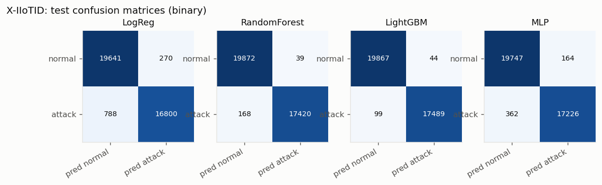

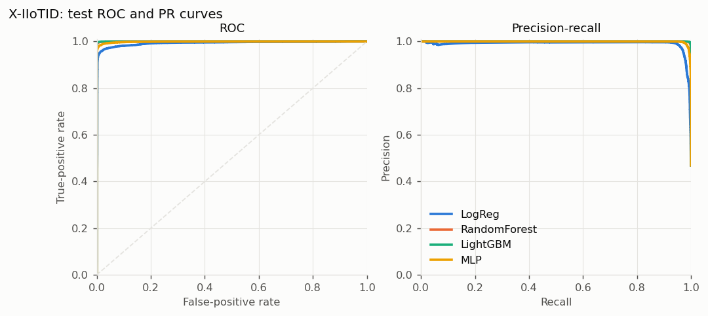

#### X-IIoTID: multiclass

| Model | Acc | Macro-F1 | Weighted-F1 | ROC-AUC (OvR macro) |
|---|---|---|---|---|
| LogReg | 0.964 | 0.938 | 0.964 | 0.998 |
| RandomForest | 0.994 | 0.990 | 0.994 | 1.000 |
| LightGBM | 0.996 | 0.994 | 0.996 | 1.000 |
| MLP | 0.969 | 0.939 | 0.970 | 0.999 |

Per-class results, best model by macro-F1 (LightGBM):

| Class | Precision | Recall | F1 | Test support |
|---|---|---|---|---|
| C&C | 0.980 | 1.000 | 0.990 | 240 |
| Exfiltration | 1.000 | 0.999 | 1.000 | 1180 |
| Exploitation | 0.994 | 0.988 | 0.991 | 168 |
| Lateral _movement | 0.979 | 0.982 | 0.980 | 1713 |
| Normal | 0.996 | 0.996 | 0.996 | 19911 |
| RDOS | 1.000 | 0.999 | 1.000 | 3863 |
| Reconnaissance | 0.996 | 0.992 | 0.994 | 6588 |
| Tampering | 0.978 | 1.000 | 0.989 | 352 |
| Weaponization | 1.000 | 1.000 | 1.000 | 3416 |
| crypto-ransomware | 1.000 | 1.000 | 1.000 | 68 |

Extra: X-IIoTID `class1` (19 types), LightGBM. Classes with under 100 unique rows are flagged *unstable*.

Accuracy 0.996, macro-F1 0.975.

| class1 | Unique rows | Precision | Recall | F1 | Test support | Flag |
|---|---|---|---|---|---|---|
| BruteForce | 46990 | 1.000 | 1.000 | 1.000 | 2393 |  |
| C&C | 2849 | 0.980 | 1.000 | 0.990 | 240 |  |
| Dictionary | 2093 | 1.000 | 1.000 | 1.000 | 203 |  |
| Discovering_resources | 22753 | 0.978 | 0.983 | 0.981 | 1211 |  |
| Exfiltration | 22133 | 1.000 | 0.999 | 1.000 | 1180 |  |
| Fake_notification | 28 | 0.800 | 1.000 | 0.889 | 4 | unstable (<100 rows) |
| False_data_injection | 5073 | 0.980 | 0.997 | 0.989 | 348 |  |
| Generic_scanning | 50178 | 1.000 | 1.000 | 1.000 | 2548 |  |
| MQTT_cloud_broker_subscription | 20806 | 0.999 | 0.999 | 0.999 | 1116 |  |
| MitM | 112 | 1.000 | 0.882 | 0.938 | 17 |  |
| Modbus_register_reading | 5953 | 1.000 | 1.000 | 1.000 | 392 |  |
| Normal | 406197 | 0.997 | 0.995 | 0.996 | 19911 |  |
| RDOS | 77134 | 1.000 | 0.999 | 1.000 | 3863 |  |
| Reverse_shell | 1015 | 1.000 | 1.000 | 1.000 | 151 |  |
| Scanning_vulnerability | 52710 | 1.000 | 0.999 | 1.000 | 2672 |  |
| TCP Relay | 2116 | 0.793 | 0.898 | 0.842 | 205 |  |
| crypto-ransomware | 458 | 0.986 | 1.000 | 0.993 | 68 |  |
| fuzzing | 1145 | 0.934 | 0.898 | 0.916 | 157 |  |
| insider_malcious | 14736 | 1.000 | 1.000 | 1.000 | 820 |  |

### TON_IoT-Network

Split: stratified random 70/15/15 by finest attack type (no usable time order). Test rows: 15,709 (77.0% attack).

| Model | Acc | Prec | Recall | F1 (attack) | Macro-F1 | ROC-AUC | PR-AUC | FPR | FNR | Train s | Infer ms/1k rows |
|---|---|---|---|---|---|---|---|---|---|---|---|
| LogReg | 0.976 | 0.991 | 0.978 | 0.985 | 0.967 | 0.992 | 0.998 | 0.028 | 0.022 | 3.7 | 9.74 |
| RandomForest | 0.998 | 0.998 | 0.999 | 0.998 | 0.997 | 1.000 | 1.000 | 0.006 | 0.001 | 7.8 | 22.56 |
| LightGBM | 0.998 | 0.999 | 0.998 | 0.998 | 0.997 | 1.000 | 1.000 | 0.004 | 0.002 | 3.2 | 20.37 |
| MLP | 0.991 | 0.996 | 0.992 | 0.994 | 0.987 | 0.999 | 1.000 | 0.013 | 0.008 | 37.4 | 10.52 |

Project zero-shot method (web app model `all-MiniLM-L6-v2`, 97 technique texts), on a stratified test sample of 2,000 rows (1,539 attack); ROC/PR-AUC use the raw max-similarity score. Inference time includes embedding on CPU.

| Model | Acc | Prec | Recall | F1 (attack) | Macro-F1 | ROC-AUC | PR-AUC | FPR | FNR | Train s | Infer ms/1k rows |
|---|---|---|---|---|---|---|---|---|---|---|---|
| Zero-shot, deployed threshold (0.416) | 0.770 | 0.770 | 1.000 | 0.870 | 0.437 | 0.740 | 0.894 | 0.998 | 0.000 | none | 7831 |
| Zero-shot, threshold tuned on train sample (0.471) | 0.777 | 0.778 | 0.994 | 0.873 | 0.485 | 0.740 | 0.894 | 0.948 | 0.006 | none | 7831 |

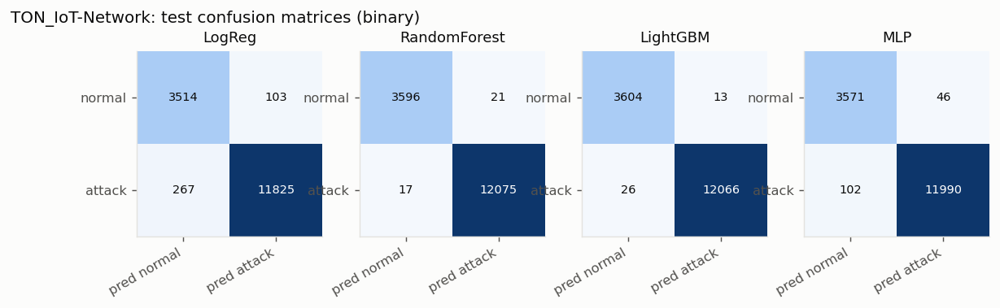

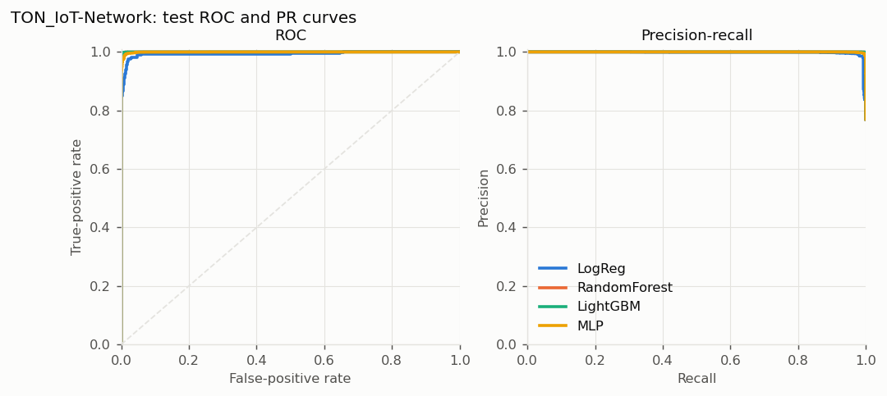

#### TON_IoT-Network: multiclass

| Model | Acc | Macro-F1 | Weighted-F1 | ROC-AUC (OvR macro) |
|---|---|---|---|---|
| LogReg | 0.779 | 0.687 | 0.787 | 0.976 |
| RandomForest | 0.977 | 0.959 | 0.978 | 0.996 |
| LightGBM | 0.981 | 0.959 | 0.981 | 1.000 |
| MLP | 0.813 | 0.758 | 0.814 | 0.983 |

Per-class results, best model by macro-F1 (LightGBM):

| Class | Precision | Recall | F1 | Test support |
|---|---|---|---|---|
| backdoor | 0.995 | 1.000 | 0.997 | 363 |
| ddos | 0.987 | 0.982 | 0.985 | 1880 |
| dos | 0.992 | 0.971 | 0.981 | 2171 |
| injection | 0.990 | 0.967 | 0.978 | 2978 |
| mitm | 0.657 | 0.910 | 0.763 | 156 |
| normal | 0.995 | 0.995 | 0.995 | 3617 |
| password | 0.996 | 0.986 | 0.991 | 2303 |
| ransomware | 0.971 | 0.985 | 0.978 | 68 |
| scanning | 0.951 | 0.978 | 0.965 | 862 |
| xss | 0.936 | 0.982 | 0.958 | 1311 |

### TON_IoT-Modbus

Split: stratified random 70/15/15 by finest attack type (no usable time order). Test rows: 1,331 (57.7% attack).

| Model | Acc | Prec | Recall | F1 (attack) | Macro-F1 | ROC-AUC | PR-AUC | FPR | FNR | Train s | Infer ms/1k rows |
|---|---|---|---|---|---|---|---|---|---|---|---|
| LogReg | 0.526 | 0.604 | 0.517 | 0.557 | 0.524 | 0.538 | 0.601 | 0.462 | 0.483 | 0.0 | 3.35 |
| RandomForest | 0.531 | 0.571 | 0.753 | 0.649 | 0.471 | 0.491 | 0.577 | 0.771 | 0.247 | 1.8 | 61.63 |
| LightGBM | 0.541 | 0.610 | 0.568 | 0.588 | 0.535 | 0.534 | 0.596 | 0.496 | 0.432 | 2.5 | 4.69 |
| MLP | 0.485 | 0.554 | 0.552 | 0.553 | 0.472 | 0.478 | 0.559 | 0.607 | 0.448 | 1.5 | 20.62 |

Project zero-shot method (web app model `all-MiniLM-L6-v2`, 97 technique texts), on a stratified test sample of 1,331 rows (768 attack); ROC/PR-AUC use the raw max-similarity score. Inference time includes embedding on CPU.

| Model | Acc | Prec | Recall | F1 (attack) | Macro-F1 | ROC-AUC | PR-AUC | FPR | FNR | Train s | Infer ms/1k rows |
|---|---|---|---|---|---|---|---|---|---|---|---|
| Zero-shot, deployed threshold (0.416) | 0.423 | 0.000 | 0.000 | 0.000 | 0.297 | 0.509 | 0.587 | 0.000 | 1.000 | none | 6457 |
| Zero-shot, threshold tuned on train sample (0.249) | 0.577 | 0.577 | 1.000 | 0.732 | 0.366 | 0.509 | 0.587 | 1.000 | 0.000 | none | 6457 |

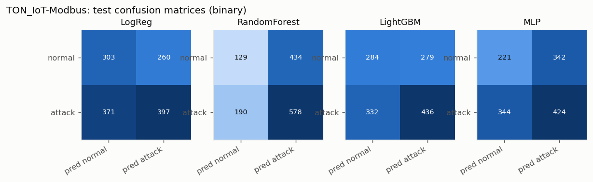

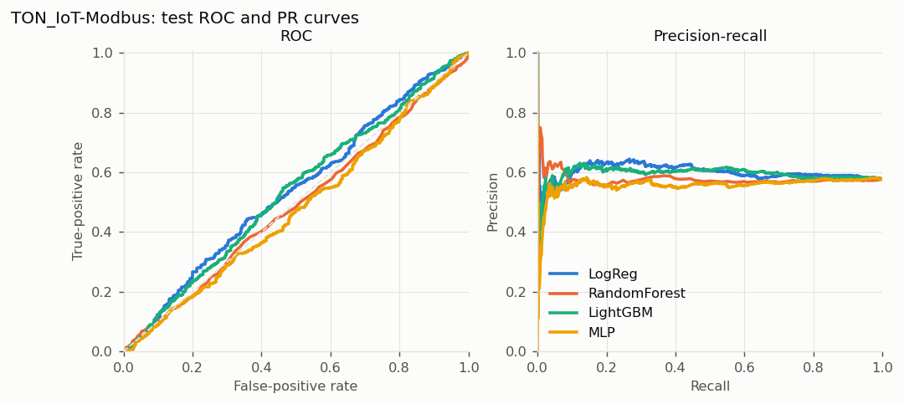

#### TON_IoT-Modbus: multiclass

| Model | Acc | Macro-F1 | Weighted-F1 | ROC-AUC (OvR macro) |
|---|---|---|---|---|
| LogReg | 0.092 | 0.084 | 0.113 | 0.507 |
| RandomForest | 0.369 | 0.119 | 0.264 | 0.508 |
| LightGBM | 0.249 | 0.168 | 0.256 | 0.518 |
| MLP | 0.128 | 0.096 | 0.145 | 0.496 |

Per-class results, best model by macro-F1 (LightGBM):

| Class | Precision | Recall | F1 | Test support |
|---|---|---|---|---|
| backdoor | 0.197 | 0.211 | 0.204 | 232 |
| injection | 0.135 | 0.181 | 0.155 | 199 |
| normal | 0.414 | 0.348 | 0.378 | 563 |
| password | 0.172 | 0.187 | 0.179 | 257 |
| scanning | 0.026 | 0.023 | 0.024 | 44 |
| xss | 0.080 | 0.056 | 0.066 | 36 |

### Appendix: other TON_IoT IoT device files (low-signal)

Each file has only 1-3 sensor features. Marked low-signal: most feature vectors repeat, and the attack/normal rows were captured at different times, so these results say little about real detection ability.

| Device file | Model | Unique rows | Acc | F1 | ROC-AUC | FPR | FNR |
|---|---|---|---|---|---|---|---|
| TON_IoT-IoT_Fridge | LogReg | 1,057 | 0.528 | 0.661 | 0.499 | 0.522 | 0.463 |
| TON_IoT-IoT_Fridge | RandomForest | 1,057 | 0.805 | 0.892 | 0.131 | 1.000 | 0.059 |
| TON_IoT-IoT_Fridge | LightGBM | 1,057 | 0.522 | 0.675 | 0.386 | 0.826 | 0.419 |
| TON_IoT-IoT_Fridge | MLP | 1,057 | 0.824 | 0.903 | 0.468 | 0.957 | 0.044 |
| TON_IoT-IoT_Garage_Door | not evaluable: only 16 unique rows after de-duplication (per label: {1: 14, 0: 2}) |  |  |  |  |  |  |
| TON_IoT-IoT_GPS_Tracker | LogReg | 38,661 | 0.718 | 0.747 | 0.847 | 0.204 | 0.330 |
| TON_IoT-IoT_GPS_Tracker | RandomForest | 38,661 | 0.941 | 0.952 | 0.974 | 0.056 | 0.061 |
| TON_IoT-IoT_GPS_Tracker | LightGBM | 38,661 | 0.926 | 0.939 | 0.975 | 0.063 | 0.081 |
| TON_IoT-IoT_GPS_Tracker | MLP | 38,661 | 0.868 | 0.897 | 0.939 | 0.233 | 0.070 |
| TON_IoT-IoT_Motion_Light | not evaluable: only 16 unique rows after de-duplication (per label: {1: 14, 0: 2}) |  |  |  |  |  |  |
| TON_IoT-IoT_Thermostat | LogReg | 30,944 | 0.532 | 0.647 | 0.505 | 0.775 | 0.211 |
| TON_IoT-IoT_Thermostat | RandomForest | 30,944 | 0.511 | 0.559 | 0.506 | 0.560 | 0.430 |
| TON_IoT-IoT_Thermostat | LightGBM | 30,944 | 0.503 | 0.519 | 0.498 | 0.485 | 0.508 |
| TON_IoT-IoT_Thermostat | MLP | 30,944 | 0.525 | 0.624 | 0.496 | 0.713 | 0.276 |
| TON_IoT-IoT_Weather | LogReg | 37,988 | 0.556 | 0.609 | 0.564 | 0.446 | 0.443 |
| TON_IoT-IoT_Weather | RandomForest | 37,988 | 0.984 | 0.987 | 0.999 | 0.022 | 0.012 |
| TON_IoT-IoT_Weather | LightGBM | 37,988 | 0.974 | 0.979 | 0.995 | 0.028 | 0.024 |
| TON_IoT-IoT_Weather | MLP | 37,988 | 0.821 | 0.841 | 0.925 | 0.088 | 0.235 |

## 3. Sanity checks and leakage

| Dataset | Models with test acc > 99% | Test rows whose features occur in train | Most separating single feature | Top LightGBM feature |
|---|---|---|---|---|
| BATADAL | none | 0 (0.0%) | `L_T1` AUC 0.744, stump F1 0.126 | `L_T1` (14% of gain) |
| Edge-IIoTset | RandomForest 0.9918, LightGBM 0.9939 | 27 (2.8%) | `http.request.method` AUC 0.865, stump F1 0.840 | `http.request.method` (49% of gain) |
| X-IIoTID | RandomForest 0.9945, LightGBM 0.9962 | 0 (0.0%) | `service_port` AUC 0.783, stump F1 0.616 | `Service` (28% of gain) |
| TON_IoT-Network | RandomForest 0.9976, LightGBM 0.9975, MLP 0.9906 | 33 (0.2%) | `dst_pkts` AUC 0.837, stump F1 0.923 | `conn_state` (31% of gain) |
| TON_IoT-Modbus | none | 0 (0.0%) | `FC2_Read_Discrete_Value` AUC 0.512, stump F1 0.730 | `FC3_Read_Holding_Register` (36% of gain) |

### Ablations (LightGBM, retrained without the suspicious feature(s))

**BATADAL**

| Variant | Acc | F1 | Macro-F1 | ROC-AUC | PR-AUC |
|---|---|---|---|---|---|
| baseline | 0.915 | 0.000 | 0.478 | 0.508 | 0.090 |
| without top-1 feature (L_T1) | 0.914 | 0.000 | 0.477 | 0.489 | 0.085 |

Top single features: `L_T1` (train AUC 0.744, stump test F1 0.126); `P_J269` (train AUC 0.672, stump test F1 0.100); `F_PU1` (train AUC 0.672, stump test F1 0.100); `F_PU11` (train AUC 0.617, stump test F1 0.000); `S_PU11` (train AUC 0.617, stump test F1 0.000)

**Edge-IIoTset**

| Variant | Acc | F1 | Macro-F1 | ROC-AUC | PR-AUC |
|---|---|---|---|---|---|
| baseline | 0.994 | 0.995 | 0.994 | 1.000 | 1.000 |
| without top-1 feature (http.request.method) | 0.995 | 0.996 | 0.995 | 1.000 | 1.000 |

Top single features: `http.request.method` (train AUC 0.865, stump test F1 0.840); `http.request.version` (train AUC 0.865, stump test F1 0.836); `len_http_uri` (train AUC 0.863, stump test F1 0.839); `len_http_file_data` (train AUC 0.818, stump test F1 0.774); `http.content_length` (train AUC 0.818, stump test F1 0.770)

Edge-IIoTset excluding the column-misaligned DDoS_UDP/MITM rows (17 test rows removed): acc 0.994, F1 0.995, ROC-AUC 1.000.

**X-IIoTID**

| Variant | Acc | F1 | Macro-F1 | ROC-AUC | PR-AUC |
|---|---|---|---|---|---|
| baseline | 0.996 | 0.996 | 0.996 | 1.000 | 1.000 |
| without top-1 feature (Service) | 0.996 | 0.996 | 0.996 | 1.000 | 1.000 |

Top single features: `service_port` (train AUC 0.783, stump test F1 0.616); `Avg_num_cswch/s` (train AUC 0.696, stump test F1 0.561); `Avg_system_time` (train AUC 0.681, stump test F1 0.578); `Avg_ideal_time` (train AUC 0.664, stump test F1 0.576); `Avg_user_time` (train AUC 0.640, stump test F1 0.357)

**TON_IoT-Network**

| Variant | Acc | F1 | Macro-F1 | ROC-AUC | PR-AUC |
|---|---|---|---|---|---|
| baseline | 0.998 | 0.998 | 0.997 | 1.000 | 1.000 |
| without top-1 feature (conn_state) | 0.997 | 0.998 | 0.996 | 1.000 | 1.000 |

Top single features: `dst_pkts` (train AUC 0.837, stump test F1 0.923); `dst_ip_bytes` (train AUC 0.779, stump test F1 0.923); `proto` (train AUC 0.712, stump test F1 0.881); `dst_bytes` (train AUC 0.664, stump test F1 0.624); `dns_RD` (train AUC 0.651, stump test F1 0.865)

**TON_IoT-Modbus**

| Variant | Acc | F1 | Macro-F1 | ROC-AUC | PR-AUC |
|---|---|---|---|---|---|
| baseline | 0.541 | 0.588 | 0.535 | 0.534 | 0.596 |
| without top-1 feature (FC3_Read_Holding_Register) | 0.538 | 0.666 | 0.459 | 0.501 | 0.581 |

Top single features: `FC2_Read_Discrete_Value` (train AUC 0.512, stump test F1 0.730); `FC1_Read_Input_Register` (train AUC 0.508, stump test F1 0.234); `FC3_Read_Holding_Register` (train AUC 0.505, stump test F1 0.731); `FC4_Read_Coil` (train AUC 0.505, stump test F1 0.719)

### Effect of de-duplication (LightGBM, no-dedup variant vs main)

The no-dedup variant keeps every row (as most published results do). It shows how much of a published-style score comes from identical feature vectors in train and test.

| Dataset | No-dedup acc | No-dedup F1 | No-dedup test rows seen in train | Dedup acc | Dedup F1 |
|---|---|---|---|---|---|
| Edge-IIoTset | 0.9960 | 0.9936 | 99.1% | 0.9939 | 0.9947 |
| X-IIoTID | 0.9966 | 0.9967 | 8.9% | 0.9962 | 0.9959 |
| TON_IoT-Network | 0.9988 | 0.9992 | 53.7% | 0.9975 | 0.9984 |
| TON_IoT-Modbus | 0.9715 | 0.9722 | 93.6% | 0.5409 | 0.5880 |

### Project zero-shot method: summary

Reproduced from `webapp/app.py`: verdict ATTACK when the max cosine similarity to the 97 ATT&CK ICS technique texts is >= 0.4158 (`results.json`). Recomputed from `procedure_examples.json` and the benign sentences: 0.4158 (matches). Techniques used in the analyst mapping but absent from `techniques.json`: Spoof Reporting Message, Unauthorized Command Message.

| Dataset | Mean max-sim normal / attack | Rows flagged at deployed threshold | F1 | ROC-AUC | Top-1 technique agrees with analyst map | Most frequent top-1 techniques |
|---|---|---|---|---|---|---|
| BATADAL | 0.156 / 0.156 | 0.0% | 0.000 | 0.477 | 0.0% | Point & Tag Identification, Loss of Productivity and Revenue, Detect Operating Mode |
| Edge-IIoTset | 0.479 / 0.469 | 83.4% | 0.651 | 0.434 | 0.0% | Commonly Used Port, Standard Application Layer Protocol |
| X-IIoTID | 0.352 / 0.348 | 0.0% | 0.000 | 0.459 | 0.4% | Standard Application Layer Protocol, Commonly Used Port, Adversary-in-the-Middle |
| TON_IoT-Network | 0.519 / 0.543 | 100.0% | 0.870 | 0.740 | 0.0% | Commonly Used Port, Network Connection Enumeration |
| TON_IoT-Modbus | 0.264 / 0.264 | 0.0% | 0.000 | 0.509 | 0.0% | Manipulate I/O Image, Change Operating Mode |

## 4. Cross-dataset analysis

### Feature-schema comparison

| Concept | BATADAL | Edge-IIoTset | X-IIoTID | TON_IoT-Network | TON_IoT-Modbus |
|---|---|---|---|---|---|
| Transport protocol |  | tcp.flags, tcp.connection.* | Protocol | proto |  |
| Application service |  | implied by http/mqtt/dns/mbtcp field groups | Service | service |  |
| Flow duration |  |  | Duration | duration |  |
| Bytes per direction |  | tcp.len (per packet only) | Scr_bytes, Des_bytes, Scr_ip_bytes, Des_ip_bytes | src_bytes, dst_bytes, src_ip_bytes, dst_ip_bytes |  |
| Packets per direction |  |  | Scr_pkts, Des_pkts | src_pkts, dst_pkts |  |
| TCP connection state / flags |  | tcp.connection.syn/fin/rst/synack, tcp.flags.ack | Conn_state, is_syn_only, Is_SYN_ACK, is_pure_ack, FIN or RST | conn_state |  |
| DNS fields |  | dns.qry.qu, dns.retransmission, ... |  | dns_qclass, dns_qtype, dns_rcode, dns_AA/RD/RA |  |
| HTTP fields |  | http.request.method, http.response, ... |  | http_method, http_status_code, ... |  |
| MQTT fields |  | mqtt.msgtype, mqtt.hdrflags, ... | (Service = mqtt only) |  |  |
| Modbus |  | mbtcp.len, mbtcp.unit_id (framing only) | (Service = modbus only) |  | FC1-FC4 register values |
| Host CPU / memory / disk |  |  | Avg_/Std_ user, system, iowait, tps, kbmemused, ... |  |  |
| Host / IDS alerts |  |  | OSSEC_alert(_level), anomaly_alert, Login_attempt, File_activity, ... |  |  |
| Physical process values | tank levels, pump flows/status, valve flow/status, junction pressures |  |  |  | register values (semantics undocumented) |

| Dataset | Row granularity |
|---|---|
| BATADAL | hourly plant snapshot |
| Edge-IIoTset | single packet |
| X-IIoTID | connection flow + host window |
| TON_IoT-Network | connection flow |
| TON_IoT-Modbus | Modbus poll (4 register values) |

Row-level merging is only possible for **X-IIoTID + TON_IoT-Network**: both carry Zeek-style flow fields (protocol, service, duration, bytes and packets per direction, missed bytes). Edge-IIoTset is per-packet, BATADAL is an hourly plant snapshot and TON_IoT-Modbus is 4 register values, so no shared columns exist. All other pairs can only be compared through the shared text-embedding representation.

### Generalisation matrix: text-embedding representation

Rows rendered as short event descriptions, embedded with **`all-MiniLM-L6-v2`**, classified with a class-weighted logistic-regression probe. 5,000 training rows and 2,000 test rows per dataset (stratified by attack type; BATADAL test uses all 961 rows). The diagonal is the in-domain score.

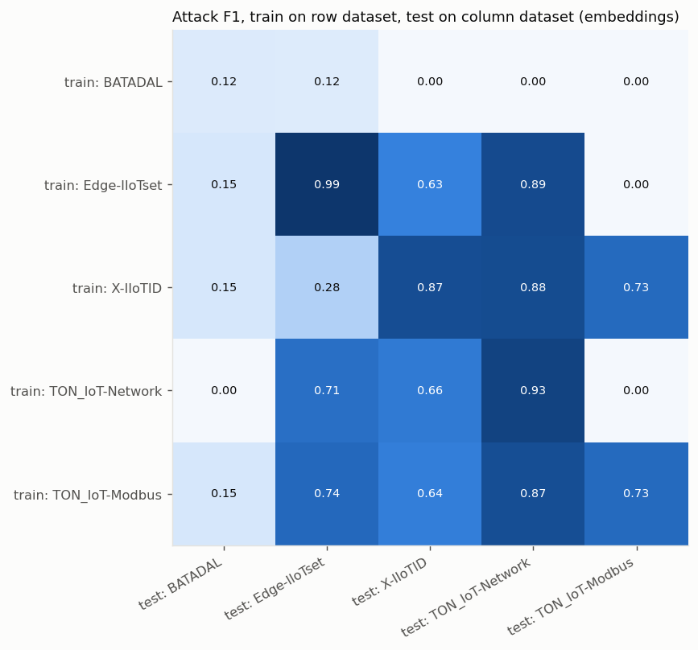

| Train \ Test | BATADAL | Edge-IIoTset | X-IIoTID | TON_IoT-Network | TON_IoT-Modbus |
|---|---|---|---|---|---|
| BATADAL | 0.125 (AUC 0.49) | 0.118 (AUC 0.77) | 0.002 (AUC 0.49) | 0.000 (AUC 0.48) | 0.000 (AUC 0.50) |
| Edge-IIoTset | 0.154 (AUC 0.58) | 0.995 (AUC 1.00) | 0.627 (AUC 0.55) | 0.891 (AUC 0.85) | 0.000 (AUC 0.51) |
| X-IIoTID | 0.154 (AUC 0.59) | 0.280 (AUC 0.27) | 0.873 (AUC 0.93) | 0.880 (AUC 0.57) | 0.732 (AUC 0.51) |
| TON_IoT-Network | 0.000 (AUC 0.53) | 0.708 (AUC 0.93) | 0.659 (AUC 0.52) | 0.928 (AUC 0.98) | 0.000 (AUC 0.51) |
| TON_IoT-Modbus | 0.154 (AUC 0.50) | 0.739 (AUC 0.50) | 0.640 (AUC 0.50) | 0.870 (AUC 0.50) | 0.732 (AUC 0.50) |

### Generalisation matrix: row-level, harmonised flow features (X-IIoTID and TON_IoT-Network)

LightGBM on the 10 shared flow features: `proto`, `service`, `duration`, `src_bytes`, `dst_bytes`, `missed_bytes`, `src_pkts`, `src_ip_bytes`, `dst_pkts`, `dst_ip_bytes`.

| Train \ Test | X-IIoTID | TON_IoT-Network |
|---|---|---|
| X-IIoTID | 0.985 (AUC 1.00) | 0.805 (AUC 0.82) |
| TON_IoT-Network | 0.548 (AUC 0.55) | 0.997 (AUC 1.00) |
| Merged (both) | 0.985 (AUC 1.00) | 0.997 (AUC 1.00) |

Service vocabularies differ (X-IIoTID: coap, dhcp, dns, echo, http, https, imap, modbus, mqtt, mysql, netbios-ns, other, private, simple_service_discovery, smtp, ssh, websocket; TON_IoT-Network: dce_rpc, dns, ftp, gssapi, http, na, smb, smb;gssapi, ssl), which limits how far the shared `service` feature actually aligns.

## 5. Merge experiments

Each group's training samples are concatenated (equal rows per dataset); the model is tested on each member's own held-out test sample and compared with that dataset's single-dataset model in the same representation (embedding diagonal) and with its best native-feature model from Section 2.

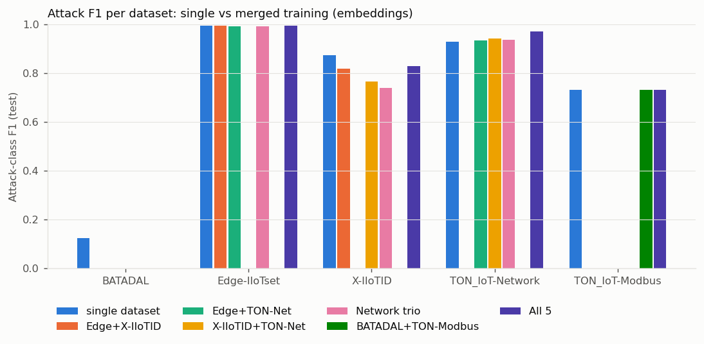

| Merge group | Tested on | Merged F1 (emb) | Single F1 (emb) | Change | Best native single F1 |
|---|---|---|---|---|---|
| Edge+X-IIoTID | Edge-IIoTset | 0.995 | 0.995 | +0.000 | 0.995 (LightGBM) |
| Edge+X-IIoTID | X-IIoTID | 0.818 | 0.873 | -0.055 | 0.996 (LightGBM) |
| Edge+TON-Net | Edge-IIoTset | 0.992 | 0.995 | -0.003 | 0.995 (LightGBM) |
| Edge+TON-Net | TON_IoT-Network | 0.932 | 0.928 | +0.004 | 0.998 (RandomForest) |
| X-IIoTID+TON-Net | X-IIoTID | 0.764 | 0.873 | -0.109 | 0.996 (LightGBM) |
| X-IIoTID+TON-Net | TON_IoT-Network | 0.941 | 0.928 | +0.013 | 0.998 (RandomForest) |
| Network trio | Edge-IIoTset | 0.991 | 0.995 | -0.004 | 0.995 (LightGBM) |
| Network trio | X-IIoTID | 0.739 | 0.873 | -0.134 | 0.996 (LightGBM) |
| Network trio | TON_IoT-Network | 0.937 | 0.928 | +0.008 | 0.998 (RandomForest) |
| BATADAL+TON-Modbus | BATADAL | 0.000 | 0.125 | -0.125 | 0.053 (MLP) |
| BATADAL+TON-Modbus | TON_IoT-Modbus | 0.732 | 0.732 | +0.000 | 0.649 (RandomForest) |
| All 5 | BATADAL | 0.000 | 0.125 | -0.125 | 0.053 (MLP) |
| All 5 | Edge-IIoTset | 0.995 | 0.995 | +0.000 | 0.995 (LightGBM) |
| All 5 | X-IIoTID | 0.828 | 0.873 | -0.045 | 0.996 (LightGBM) |
| All 5 | TON_IoT-Network | 0.969 | 0.928 | +0.041 | 0.998 (RandomForest) |
| All 5 | TON_IoT-Modbus | 0.732 | 0.732 | +0.000 | 0.649 (RandomForest) |

Row-level merge X-IIoTID + TON_IoT-Network (harmonised flows): X-IIoTID: merged F1 0.985 vs single 0.985; TON_IoT-Network: merged F1 0.997 vs single 0.997.

## 5b. Label noise, imbalance and attack coverage (MITRE ATT&CK for ICS)

Technique mapping by the study author (nearest technique; 'loose' = IT-side attack with only an approximate ICS technique). Review before treating as ground truth.

| Dataset | Attack share (unique rows) | Attack types | Smallest / largest type | Label-quality notes | ATT&CK for ICS techniques covered |
|---|---|---|---|---|---|
| BATADAL | 1.7% | 1 | 219 / 219 | -999 rows treated as normal; some dataset04 attacks were deliberately left unlabelled; 0 conflicting-label rows | T0831 Manipulation of Control, T0832 Manipulation of View, T0836 Modify Parameter, T0855 Unauthorized Command Message, T0856 Spoof Reporting Message |
| Edge-IIoTset | 58.7% | 14 | 1 / 2,610 | 99.7% feature-duplicates; DDoS_UDP/MITM rows column-misaligned in source; 61 conflicting-label rows | T0809 Data Destruction, T0814 Denial of Service, T0819 Exploit Public-Facing Application, T0828 Loss of Productivity and Revenue, T0830 Adversary-in-the-Middle, T0840 Network Connection Enumeration, T0846 Remote System Discovery, T0859 Valid Accounts, T0869 Standard Application Layer Protocol, T0886 Remote Services, T0888 Remote System Information Discovery |
| X-IIoTID | 44.7% | 18 | 28 / 77,134 | 10.5% feature-duplicates; 2.7M '-' placeholders in flow fields (non-TCP/host-only records); 6 conflicting-label rows | T0802 Automated Collection, T0807 Command-Line Interface, T0809 Data Destruction, T0814 Denial of Service, T0828 Loss of Productivity and Revenue, T0832 Manipulation of View, T0836 Modify Parameter, T0840 Network Connection Enumeration, T0846 Remote System Discovery, T0856 Spoof Reporting Message, T0859 Valid Accounts, T0861 Point & Tag Identification, T0866 Exploitation of Remote Services, T0869 Standard Application Layer Protocol, T0882 Theft of Operational Information, T0884 Connection Proxy, T0886 Remote Services, T0888 Remote System Information Discovery, T0891 Hardcoded Credentials |
| TON_IoT-Network | 77.0% | 9 | 454 / 19,850 | 50.4% feature-duplicates; protocol-specific fields mostly '-'; 19 conflicting-label rows | T0809 Data Destruction, T0814 Denial of Service, T0819 Exploit Public-Facing Application, T0828 Loss of Productivity and Revenue, T0830 Adversary-in-the-Middle, T0840 Network Connection Enumeration, T0846 Remote System Discovery, T0859 Valid Accounts, T0869 Standard Application Layer Protocol, T0886 Remote Services |
| TON_IoT-Modbus | 57.7% | 5 | 245 / 1,712 | 71.5% feature-duplicates; 'time' formatting differs by label (dropped); 0 conflicting-label rows | T0819 Exploit Public-Facing Application, T0836 Modify Parameter, T0846 Remote System Discovery, T0855 Unauthorized Command Message, T0856 Spoof Reporting Message, T0859 Valid Accounts, T0861 Point & Tag Identification, T0869 Standard Application Layer Protocol, T0886 Remote Services |

Per-label technique mapping

**BATADAL**

| Label | Techniques | Fit | Note |
|---|---|---|---|
| attack | T0831 Manipulation of Control, T0832 Manipulation of View, T0836 Modify Parameter, T0855 Unauthorized Command Message, T0856 Spoof Reporting Message | direct | sensor/actuator manipulation and concealment (tank levels, pump/valve settings) |

**Edge-IIoTset**

| Label | Techniques | Fit | Note |
|---|---|---|---|
| DDoS_UDP | T0814 Denial of Service | direct |  |
| DDoS_ICMP | T0814 Denial of Service | direct |  |
| DDoS_TCP | T0814 Denial of Service | direct |  |
| DDoS_HTTP | T0814 Denial of Service | direct |  |
| Port_Scanning | T0846 Remote System Discovery, T0840 Network Connection Enumeration | direct |  |
| Fingerprinting | T0888 Remote System Information Discovery | direct |  |
| Vulnerability_scanner | T0846 Remote System Discovery, T0888 Remote System Information Discovery | direct |  |
| Password | T0859 Valid Accounts | loose | credential brute force; ICS matrix has no generic brute-force technique |
| SQL_injection | T0819 Exploit Public-Facing Application | loose | web-app attack |
| XSS | T0819 Exploit Public-Facing Application | loose | web-app attack |
| Uploading | T0819 Exploit Public-Facing Application | loose | malicious file upload to web app |
| Backdoor | T0869 Standard Application Layer Protocol, T0886 Remote Services | loose |  |
| Ransomware | T0809 Data Destruction, T0828 Loss of Productivity and Revenue | direct |  |
| MITM | T0830 Adversary-in-the-Middle | direct | ARP spoofing |

**X-IIoTID**

| Label | Techniques | Fit | Note |
|---|---|---|---|
| Reconnaissance | T0846 Remote System Discovery, T0840 Network Connection Enumeration, T0888 Remote System Information Discovery | direct | Generic_scanning, Scanning_vulnerability, Discovering_resources, fuzzing |
| Weaponization | T0859 Valid Accounts, T0891 Hardcoded Credentials | loose | BruteForce, Dictionary, insider_malcious |
| Exploitation | T0866 Exploitation of Remote Services, T0807 Command-Line Interface | direct | Reverse_shell |
| Lateral _movement | T0886 Remote Services, T0861 Point & Tag Identification, T0802 Automated Collection | direct | MQTT_cloud_broker_subscription, Modbus_register_reading, TCP Relay |
| C&C | T0869 Standard Application Layer Protocol, T0884 Connection Proxy | direct |  |
| Exfiltration | T0882 Theft of Operational Information | direct |  |
| Tampering | T0856 Spoof Reporting Message, T0832 Manipulation of View, T0836 Modify Parameter | direct | False_data_injection, Fake_notification |
| RDOS | T0814 Denial of Service | direct |  |
| crypto-ransomware | T0809 Data Destruction, T0828 Loss of Productivity and Revenue | direct |  |

**TON_IoT-Network**

| Label | Techniques | Fit | Note |
|---|---|---|---|
| scanning | T0846 Remote System Discovery, T0840 Network Connection Enumeration | direct |  |
| dos | T0814 Denial of Service | direct |  |
| ddos | T0814 Denial of Service | direct |  |
| injection | T0819 Exploit Public-Facing Application | loose | web/data injection |
| xss | T0819 Exploit Public-Facing Application | loose |  |
| password | T0859 Valid Accounts | loose |  |
| backdoor | T0869 Standard Application Layer Protocol, T0886 Remote Services | loose |  |
| ransomware | T0809 Data Destruction, T0828 Loss of Productivity and Revenue | direct |  |
| mitm | T0830 Adversary-in-the-Middle | direct |  |

**TON_IoT-Modbus**

| Label | Techniques | Fit | Note |
|---|---|---|---|
| injection | T0855 Unauthorized Command Message, T0836 Modify Parameter, T0856 Spoof Reporting Message | direct | data injection into Modbus register values |
| backdoor | T0869 Standard Application Layer Protocol, T0886 Remote Services | loose |  |
| password | T0859 Valid Accounts | loose |  |
| xss | T0819 Exploit Public-Facing Application | loose |  |
| scanning | T0846 Remote System Discovery, T0861 Point & Tag Identification | direct |  |

## 6. Recommendation

### Datasets to merge

| Dataset | Decision | Evidence |
|---|---|---|
| **Edge-IIoTset** | **Merge** | De-duplicated test: LightGBM F1 0.995, with no single-feature leak (best single-feature AUC 0.87; dropping the top feature changes nothing). Embedding space: Edge-IIoTset → TON_IoT-Network F1 0.89 (AUC 0.85), and TON_IoT-Network → Edge-IIoTset AUC 0.93. Merging with TON_IoT-Network keeps both: Edge 0.992 vs 0.995 single, TON 0.932 vs 0.928 single. |
| **TON_IoT-Network** | **Merge** | De-duplicated test: LightGBM F1 0.998, with no single-feature leak (best single-feature AUC 0.84). It's the only dataset that clearly improves in the all-5 merge (0.969 vs 0.928 single). Row-level transfer from X-IIoTID reaches AUC 0.82. |
| **X-IIoTID** | **Merge, with a known cost** | Learnable in-domain: LightGBM F1 0.996, multiclass macro-F1 0.994. But the embedding-space probe trained on it scores AUC 0.27–0.59 on the other datasets, and TON_IoT-Network → X-IIoTID scores only AUC 0.55 on shared flow features. Merging lowers its own embedding F1 from 0.87 to 0.74–0.83, though AUC stays ≥0.91. A row-level merge with TON_IoT-Network on the 10 shared flow features costs nothing (0.985 merged vs 0.985 single). I recommend including it because it adds attack stages no other dataset has: exfiltration, C&C, tampering/false-data injection, Modbus register reading, and lateral movement. |
| **BATADAL** | **Exclude from the merge; handle separately** | No row-level signal. Chronological test: every model has F1 ≤ 0.05, and LogReg/MLP ROC-AUC is 0.09/0.17, meaning the patterns are inverted between attack windows. Leave-one-window-out mean F1 is at most 0.20 (RandomForest AUC 0.79 ± 0.17). Zero-shot AUC is 0.48. Its attacks are process manipulations that need a time-series or residual anomaly detector trained on normal operation, not a per-row classifier. Keep it as an evaluation set for a separate process-anomaly module. |
| **TON_IoT-Modbus** | **Exclude** | After de-duplication, all four models are at chance (ROC-AUC 0.48–0.54, multiclass macro-F1 ≤ 0.17). The four register values carry no label signal. The 0.97 no-dedup accuracy comes entirely from duplicates: 93.6% of test rows also appear in train. |
| TON_IoT IoT devices (appendix) | Exclude | Garage_Door and Motion_Light collapse to 16 unique rows, and Fridge and Thermostat are at chance. GPS_Tracker and Weather score 0.93–0.97, but with 2–3 sensor values per row that more likely reflects when the capture was made than the attack itself. I didn't verify this. |

### Model for the final system
**LightGBM.** It has the best or tied-best attack F1 on all three learnable datasets (Edge-IIoTset 0.995, X-IIoTID 0.996, TON_IoT-Network 0.998) and the best or tied-best multiclass macro-F1 on all four multiclass datasets. It also trains 3–8× faster than RandomForest or the MLP on X-IIoTID, and inference costs about 9–20 ms per 1,000 rows on CPU. RandomForest is a close second. LogReg and the MLP are 0.4–2.6 F1 points lower.

### What this means for the web app
The web app takes free-text events, so it can't use native dataset columns. Two concrete options for Step 6:
1. **Supervised detector on the same embeddings (recommended).** Train a class-weighted classifier on `all-MiniLM-L6-v2` embeddings of the merged datasets. In-domain probe F1 is 0.99 on Edge-IIoTset, 0.93 on TON_IoT-Network and 0.87 on X-IIoTID, compared with 0.00–0.87 for zero-shot at the deployed threshold. The attack/benign verdict then comes from the classifier, and the nearest ATT&CK technique is kept only as an explanation, clearly labelled as approximate.
2. **Native LightGBM per data source**, for structured flow or packet input. This gives the best scores, but the app would need structured input fields, not free text.

**Do not keep the similarity threshold as the detector.** On these datasets attack and normal rows have nearly identical mean similarity to the technique texts: X-IIoTID 0.348 vs 0.352, Modbus 0.264 vs 0.264, BATADAL 0.156 vs 0.156. The top technique matches my analyst mapping for at most 0.4% of attack rows. On network data it is almost always "Commonly Used Port" or "Standard Application Layer Protocol", which reflects the port wording in the description, not the attack.

## 7. Limitations

- **The headline in-domain scores do not show real-world performance.** Edge-IIoTset, X-IIoTID and TON_IoT-Network all score above 99% after de-duplication. That passed the leakage checks (overlap 0–2.8%, no feature with single-feature AUC above 0.87, ablations unchanged). But the cross-dataset results show the learned patterns are mostly testbed-specific. Expect much lower scores on traffic from a different plant.
- **Edge-IIoTset is far smaller than its file size suggests.** 2,219,201 rows contain only 6,513 unique feature vectors under the agreed field policy. DDoS_UDP, DDoS_ICMP and Port_Scanning reduce to 1, 3 and 5 unique packets. They stay in training but can't be tested: their multiclass F1 of 0 means "no test rows", not "missed". The test set is only 976 rows.
- **Source-data defects.** All DDoS_UDP and MITM rows in Edge-IIoTset are column-misaligned in the published CSV. Their timestamp, IP and port columns were dropped or neutralised, and excluding them from the test set doesn't change the score (F1 0.995 vs 0.995). TON_IoT IoT files encode the label through formatting (Garage_Door `true`/`false` vs `1`/`0`, and a leading space in Modbus `time`). Both were normalised or dropped.
- **BATADAL labels are noisy.** `-999` was treated as normal, although some dataset04 attacks were deliberately left unlabelled. The test set has only 2 attack windows (80 hours). The leave-one-window-out folds train on data from after the test period.
- **Embedding experiments use samples:** 5,000 training rows and 2,000 test rows per dataset (fewer where a test split is smaller), all-MiniLM-L6-v2, and a linear probe. The event descriptions use my template: up to 20 non-zero fields, plus HTTP method and URI with the host removed. A different template or a larger language model could change these results.
- **The zero-shot reproduction uses the web app's exact model, technique texts and threshold.** The threshold recomputes to 0.4158, matching `results.json`. But the web app was designed for prose event descriptions, not table rows turned into text, which are much less like the MITRE descriptions. Its failure here applies to that input form.
- **The ATT&CK mapping is mine, not the dataset authors'.** Several IT attacks (SQLi, XSS, password guessing) have only loose ICS equivalents. `techniques.json` lacks T0855 Unauthorized Command Message and T0856 Spoof Reporting Message, the most relevant techniques for BATADAL and Modbus injection.
- **Hyperparameter search was light** (2–3 configurations per model), and the decision threshold was fixed at 0.5. Multiclass runs reuse the binary configuration. X-IIoTID was capped at 250,000 of its 734,479 unique rows, sampled by attack type.
- **Not yet tested:** temporal models for BATADAL, testing on a dataset outside these five, and the final merged model itself (that's Step 6, after your decision).

## 8. Outcome: final merged model

The recommendation was accepted: **Edge-IIoTset, TON_IoT-Network, X-IIoTID** were merged and BATADAL and TON_IoT-Modbus left out. The final model `ics_ids_merged_v1` v1.0.0 is a LightGBM (leaves=31) classifier on all-MiniLM-L6-v2 embeddings of the event descriptions, the only representation in which the three datasets' different columns merge. Selection used the validation splits only; the test rows below were never used for tuning.

| Held-out test set | Rows | F1 (attack) | ROC-AUC | False-positive rate |
|---|---|---|---|---|
| Edge-IIoTset | 976 | 0.993 | 0.999 | 0.010 |
| TON_IoT-Network | 2,000 | 0.994 | 1.000 | 0.013 |
| X-IIoTID | 2,004 | 0.968 | 0.995 | 0.027 |
| MERGED (all three test sets pooled) | 4,980 | 0.986 | 0.998 | 0.020 |

On the web app's own handwritten sentences (271 procedure examples and 15 benign sentences) the model is near chance: it flags 62.4% of the attack examples and 66.7% of the benign ones (ROC-AUC 0.553). The web app therefore uses it only for structured events and keeps free-text analysis as an experimental, low-confidence mode.
